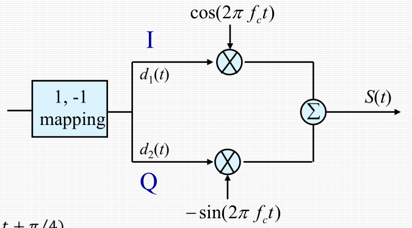
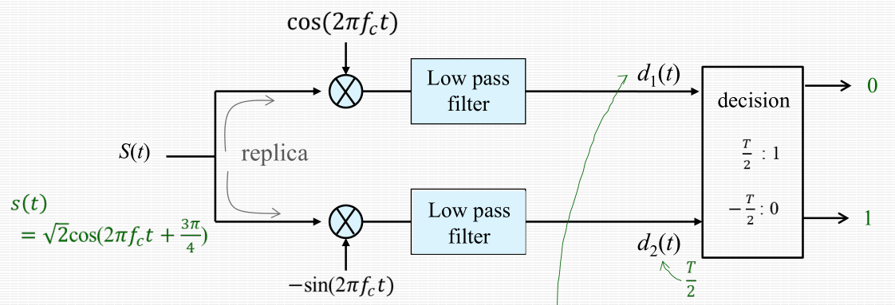

# 2022-04-24
## Signal Encoding Techniques
- Digital Data &rarr; Digital Signals
    - **RZ (Return to Zero)**
    - **NRZ (Non-Return to Zero)**  
        >Pros:  
        >   1. simple  
        >   2. efficient use of bandwidth  

        >Cons:  
        >   1. presence of DC component  
        >   2. lack of synchronization capability  

        - **NRZ-L (NRZ Level)**
            - 0: positive voltage
            - 1: negative voltage
        - **NRZ-I (NRZ Inverted)**
            - 0: no transition
            - 1: transition at the beginning of bit interval
    - **Multilevel Binary**  
        >Pros:  
        >   1. no DC component  
        >   2. better synchronization than NRZ  
        >   3. error detection capability  
        >   4. efficient use of bandwidth  
        
        >Cons:  

        - **Bipolar-AMI (Alternate Mark Inversion)**
            - 0: zero voltage
            - 1: alternately by positive and negative voltages
        - **Pseudoternary**
            - Same as bipolar-AMI, except representation of 0 and 1 is interchanged

    - **Biphase**  
        >Pros:  
        >   1. synchronization  
        >   2. error detection capability  
        >   3. no DC component  
        
        >Cons:  
        >   1. inefficient use of bandwidth  

        - **Manchester**
            - 0: high to low transition
            - 1: low to high transition

        - **Differential Manchester**  
            - 0: transition at the beginning of bit interval
            - 1: no transition

    - **Scrambling Techniques**  
        >Pros:  
        >   1. No dc component  
        >   2. good synchronization  
        >   3. error detection capability  
        >   4. efficient use of bandwidth  

        >Cons:  

        - **B8ZS (Bipolar with 8-Zeros Subsitution)**
        - **HDB3 (High Density Bipolar 3-zeros)**

- Digital Data &rarr; Analog Signals
    - ASK (Amplitude Shift Keying)
    - FSK (Frequency Shift Keying)
    - PSK (Phase Shift Keying)
    - QPSK (Quadrature PSK)
    - QAM (Quadrature Amplitude Modulation)
    - Offset-QPSK

Shannon Capacity  
C=B log<sub>2</sub>(1+SNR)  
(C=Maximum rate, B=Bandwidth, SNR=Radio of Signal power to Noise power)

Decibel  
L = 10 log<sub>10</sub>(B/A)

QPSK modulation  


QPSK demodulation  



Analog Data &rarr; Digital Data
Analog-to-Digital Conversion
PCM (Pulse Code Modulation)
```
                +-------------+              +-------------+              +-------------+               
                |             |              |             |              |             |               
--------------> | PAM sampler |------------> |  Quantizer  |------------> |   Encoder   |----------------> 
 Analog input   |             | PAM pulses   |             | PCM pulses   |             | Digital output
                +-------------+              +-------------+              +-------------+               
```

Stop & Wait  
Utilization with no error  
U=1/(1+2a)  
Utilization with error  
U=(1-P)/(1+2a)  
\* frame length=L bits, P=1-<sub>L</sub>C<sub>0</sub>(1-BER)<sup>L</sup>
