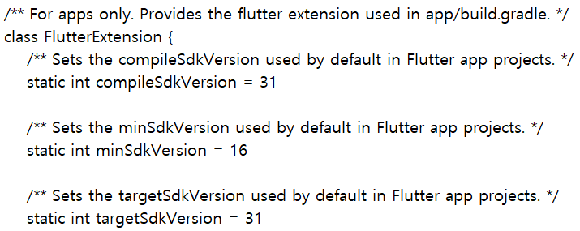

# 2022-10-09
## Android's SDK version information location
Android's SDK version information does not locate inside 
`android/app/build.gradle`, if it's using predefined flutter information.

You can find it inside here:
```
{flutter-directory}\packages\flutter_tools\gradle\flutter.gradle
```


# 2022-10-10
## rename App ID
1. install `rename` package.

`dart pub global activate rename`

2. run `rename` package.

`dart pub global run rename --bundleId {App-ID}`

# 2022-10-11
## Function.apply(function, [param1, param2, ...]) vs. function.call(param1, param2, ...)
```dart
Function(String name, int vintage) printWineDetails = ((String name, int vintage){
    print('Name: $name, Vintage: $vintage');
});


void main() {
    // Function.apply(function, [param1, param2, ...])
    Function.apply(printWineDetails, ['Cabernet Sauvignon', 2018]);
    
    // function.call(param1, param2, ...)
    printWineDetails.call('Cabernet Sauvignon', 2018);
}
```
