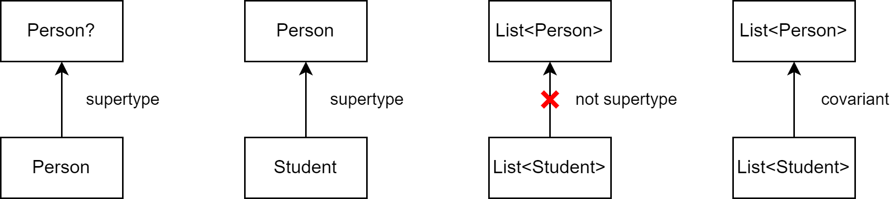

# 2022-07-15
## 확장함수는 override할 수 없다.
확장함수는 override할 수 없다. 부모-자식 간 동일한 시그니처를 가진 함수라도 컴파일 시점에 결정된다.
```kotlin
fun View.showOff() = println("It is a view.")
fun Button.showOff() = println("It is a button.")

val view: View = Button()
view.showOff() // It is a view.
```
내부적으로 확장 함수는 수신 객체를 첫 번째 인자로 받는 **정적** 메서드이기 때문이다.

# 2022-07-16
## equality & reference comparison
|   |Java|Kotlin|
|---|------|---|
|equality|equals|==|
|reference|==|===|

# 2022-07-20
## supertype vs. covariant


# 2022-07-21
## Array\<Int\> vs. IntArray
Boxed type vs. primitive type
|Kotlin|Java|
|---|------|
|Array\<Int\>|Integer[]|
|IntArray|int[]|

# 2022-07-22
## null safe examples
```Kotlin
println(null == "a") // false
println(null === "a") // false
println(null is String) // false
```

# 2022-07-23
## visibility
|visibility|class member|top level declaration|
|---|---|---|
|public (default)|everywhere|everywhere|
|internal|same module|same module|
|protected|sub-class|N/A|
|private|same class|same file|

## loop [break/continue]
Can state a loop to [break/continue].
```Kotlin
for (i in 1..3) {
    println("i=$i")
    jloop@for (j in 1..3) { // break this loop
        println("\tj=$j")
        for (k in 1..3) {
            println("\t\tk=$k")
            if (k == 2) {
                break@jloop;
            }
        }
    }
}
```
result
```Kotlin
i=1
	j=1
		k=1
		k=2
i=2
	j=1
		k=1
		k=2
i=3
	j=1
		k=1
		k=2
```

# 2022-07-24
## try-catch-finally
The value of `finally` can't be the value of the try expression.

>The value of the try-expression is the same as the value of the last expression of the try body (if no exception was thrown) or the value of the last expression of the matching catch block (if an exception was thrown and matched). [kotlin doc](https://kotlinlang.org/spec/expressions.html#try-expressions)

```Kotlin
fun getNumber(str: String): Int {
    return try {
        Integer.parseInt(str)
    } catch (e: NumberFormatException) {
        0
    } finally {
        println("finally")
        -1 // no value will be returned from finally block
    }
}

println(getNumber("5"))
```
result
```Kotlin
finally
5
```

# 2022-07-26
## Type erasure of generics
Obviously this code below works.
```Kotlin
val listAny = listOf("first", "second", "third")
val strList = listAny as List<String>
println(strList[1].replace("second", "two"))
```
result
```Kotlin
two
```

JVM doesn't know the data type of the generic at runtime.

```Kotlin
val listAny = listOf(1, 2, 3)

// No error, because the data type of generic is erased.
val strList = listAny as List<String>

println(strList[1].replace("second", "two")) // error occurs
```

## reified parameter type inside a inline function
Use `inline`, `reified` to check type within a function in runtime.
```kotlin
inline fun <reified T> function(arg: T) {
    ...
}
```

# 2022-08-11
## confusing keywords
- iterator
- iterable
- kotlin collections
- kotlin sequences
- java collections
- java stream
- eager evaluation
- lazy evaluation

# 2022-08-16
## logging in kotlin
현재 프로젝트에서는 slf4j library와 logback 구현체를 사용해 log 관리를 하고있다.  
어떤 클래스를 봐도 logger 선언부가 눈에 밟히는 것이 서서히 신경쓰이기 시작한다.

개선해야할 대상)
```kotlin
private val logger = LoggerFactory.getLogger(this::class.java)
```

logging하는 모든 class마다 logger를 얻어야할까? 상속이나 annotation으로 해결할 수 없을까?
- Lombok - @Slf4j annotation 사용 가능. 그러나 kotlin + Lombok은 해당 annotation을 지원하지 않는다.
- logger를 가지는 클래스를 상속. 그러나 이 방법은 부가적인 기능(log)을 클래스와 결합시키는 단점이 존재한다. (AOP 위반)
- inline function - 상위에 inline function을 정의한다.
```kotlin
inline fun <reified T> logger(from: T) : Logger = LoggerFactory.getLogger(T::class.java)
```
다음과 같이 선언한다.
```kotlin
private val logger = logger(this)
```
나쁘지는 않지만 여전히 선언을 필요로 한다는 점이 번거롭다. 하지만 충분히 짧아서 용인할 수 있는 정도로 보이기도 한다. 적어도 글자수는 절반으로 줄어들었다. (62자->33자)
- custom annotation - 직접 구현 필요할 것. Reflection을 사용하기 때문에 성능 저하가 발생할 수 있다. 하지만 이렇게 작은 기능만 수행하는 annotation이 가시적인 성능 저하를 가져올까...? ~~더군다나 code generation이라면...~~ type을 알아야 하는 이상 run-time일 수밖에 없다.  
custom annotation 작성 시행착오 도중 해답을 발견한 것 같다.
```kotlin
@Target(AnnotationTarget.CLASS)
@Retention(AnnotationRetention.RUNTIME)
annotation class Slf4j{
    companion object{
        val <reified T> T.logger: Logger
            inline get() = LoggerFactory.getLogger(T::class.java)
    }
}
```
[출처](https://developpaper.com/detailed-explanation-of-log-usage-in-kotlin/)

usage
```kotlin
class MyClass(){
    fun writeLog() {
        logger.info("write log")
    }
}
```
이런 방식이면 기존 코드에서  
1) logger 선언부를 삭제하고  
2) @Slf4j annotation을 붙이고  
3) (물론 작성한 Slf4j class를 import하는)  
것만 수정하면 될 것 같다.

keywords
- log4j - logging library. thread safe
- log4j2 - 명백하게 log4j의 다음 버전이다.
- slf4j - logging library의 wrapper library이다.
- logback - logging library.

log4j is thread-safe : LoggerFactory는 thread-safe하지만 LoggerFactory.getLogger()로 얻은 logger는 not thread-safe할 것이라고 추정됨. (알아봐야 함)
