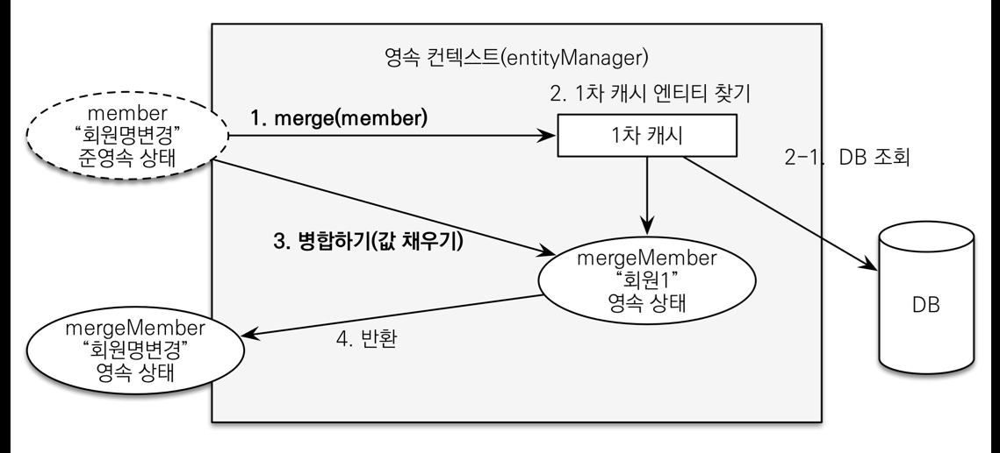

# 2022-04-17
## spring container is singleton container
- spring container는 객체 instance를 singleton으로 관리한다.
- 이렇게 singleton 객체를 생성하고 관리하는 기능을 singleton registry라고 한다.
- spring container는 singleton pattern의 단점을 해결하였다.
    - spring이 관리해주기 때문에 DIP, OCP, 테스트, private constructor로부터 자유롭게 singleton을 사용할 수 있다.
    - @Configuration decorator를 붙이면 CGLIB이라는 바이트코드 조작 라이브러리를 사용하여 내가 등록하고자 하는 클래스를 상속받은 임의의 다른 클래스를 만들고, 그것을 스프링으로 등록하여 singleton을 보장하는 것이다.
***

# 2022-04-21
## Bean duplication
중복되는 Bean이 존재할 경우 해결책:
- 구체 클래스 사용 **(BAD)** (DIP 위반)
- @Autowired 필드명 매칭
```java
@Component
public class RateDiscountPolicy implements DiscountPolicy {
    ...
}

@Component
public class FixDiscountPolicy implements DiscountPolicy {
    ...
}

@Autowired
public class OrderServiceImpl {
    public OrderServiceImpl(MemberRepository memberRepository, DiscountPolicy rateDiscountPolicy) {
        ...
    }
}
```
- @Qualifier
```java
@Component
@Qualifier("mainDiscountPolicy")
public class RateDiscountPolicy implements DiscountPolicy {
    ...
}

@Component
@Qualifier("subDiscountPolicy")
public class FixDiscountPolicy implements DiscountPolicy {
    ...
}

@Autowired
public class OrderServiceImpl {
    public OrderServiceImpl(MemberRepository memberRepository, @Qualifier("mainDiscountPolicy") DiscountPolicy discountPolicy) {
        ...
    }
}
```
- @Primary
```java
@Component
@Primary
public class RateDiscountPolicy implements DiscountPolicy {
    ...
}

@Component
public class FixDiscountPolicy implements DiscountPolicy {
    ...
}

@Autowired
public class OrderServiceImpl {
    public OrderServiceImpl(MemberRepository memberRepository, DiscountPolicy discountPolicy) {
        ...
    }
}
```

# 2022-04-22
## Lifecycle Callbacks
Java의 constructor, destructor와 비슷한 개념이 Spring에도 존재한다.  
Bean이 등록된 뒤(생성, DI가 끝난 상태)에 실행되는 초기화 콜백과, 빈이 소멸되기 직전에 호출되는 소멸전 콜백이 그것이다.  
[Spring document](https://docs.spring.io/spring-framework/docs/current/reference/html/core.html#beans-factory-nature)에서는 `@PostConstruct`, `@PreDestroy` annotator를 붙여 지정하는 것을 권장한다.  
외부 library를 사용하는 경우에는 다음과 같이 configuration에서 등록할 때 method name으로 지정한다.
```java
@Bean(initMethod = "init", destroyMethod = "close")
```

***

## ObjectProvider
singleton bean 내부에서 prototype bean을 사용하는 경우는, 그 이름이 암시하듯이 prototype bean을 spring container에 요청할 때마다 새로운 prototype bean을 받기를 원할 때이다. 단순히 singleton bean DI 시점에 prototype bean을 injection받으면 동일한 prototype bean을 유지하게 되므로 이 목적이 달성되지 않는다.  
DL(Dependency Lookup) 기능을 사용하여 해결한다. 필요할 때마다 spring container에서 찾는 것. `ApplicationContext`로 조회하는 것도 가능하지만 `ObjectProvider`를 사용하면 간결하다.
```java
// default : @Scope("singleton")
static class ClientBean {

    private final ObjectProvider<PrototypeBean> prototypeBeanObjectProvider;
    
    @Autowired
    public ClientBean(ObjectProvider<PrototypeBean> prototypeBeanObjectProvider) {
        this.prototypeBeanObjectProvider = prototypeBeanObjectProvider;
    }

    public int logic() {
        PrototypeBean prototypeBean = prototypeBeanObjectProvider.getObject();
        ...
    }
}

@Scope("prototype")
static class PrototypeBean {
    ...
}
```
ObjectProvider는 request scope bean을 다룰 때에도 유용하게 쓰인다. singleton scope bean **S**가 request scope bean **R**을 가질 때, S의 생성 및 DI 시점에는 HTTP request가 들어오지 않았다. 이후 HTTP request가 들어오면 `ObjectProvider.getObject()`를 호출하여 lazy하게 **R**을 생성하는 식이다.

# 2022-04-23
## Proxy
request scope bean을 다룰 때(그리고 그외 필요할 상황에서) ObjectProvider보다 더 간편한 방법은 Proxy를 사용하는 것이다.
```java
@Component
@Scope(value = "request", proxyMode = ScopedProxyMode.TARGET_CLASS)
public class MyLogger {
    ...
}

@Controller
@RequiredArgsConstructor
public class LogDemoController {
    private final MyLogger myLogger;
    ...
}
```
CGLIB이 내가 등록할 객체 **R**을 상속하는 proxy 객체 **P**를 생성하고, spring container에 **P**를 등록한다. **P**에는 요청이 오면 그때 **R**을 요청하는 위임 로직이 들어있다.  
따라서 사용자 입장에서는 HTTP request가 들어올 때 **P**를 요청하면, 그때 **P**가 **R**을 요청하므로 원하는 결과를 얻게 된다. 마치 singleton bean처럼 사용할 수 있는 것이다.

***

## @RequestMapping, @GetMapping, @PostMapping
@GetMapping, @PostMapping을 @RequestMapping의 shortcut으로 사용할 수 있다.  
`@RequestMapping(value = "/...", method = RequestMethod.GET)` can be replaced by `@GetMapping("/...")`  
`@RequestMapping(value = "/...", method = RequestMethod.POST)` can be replaced by `@PostMapping("/...")`  

# 2022-05-11
## @Transactional
`@Transactional` annotation은 `@Test`와 함께 사용될 경우 Test가 끝나면 DB를 rollback한다. 직접 DB를 확인해보고 싶다면 `@Rollback(false)` annotation을 사용한다.

# 2022-05-12
## Spring Data JPA
1:N relation
```java
// N-side
@ManyToOne(fetch = FetchType.LAZY)
@JoinColumn(name = "column_name")

// 1-side
@OneToMany(mappedBy = "entity_member_name")
```

1:1 relation에서는 조회가 더 빈번한 쪽을 FK로 삼는다.
```java
// frequent
@OneToOne(fetch = FetchType.LAZY)
@JoinColumn(name = "column_name")

// rare
@OneToOne(mappedBy = "entity_member_name", fetch = FetchType.LAZY)
```

기본적으로 OneToMany는 fetch=FetchType.LAZY이지만 ~ToOne은 fetch=FetchType.EAGER이다. EAGER option은 JQPL을 날릴 때 연관된 모든 entity를 끌고오므로 성능 문제가 발생한다(N+1 문제). 따라서 항상 fetch=FetchType.LAZY로 바꿔주는 게 좋다.

## Spring Data JPA, EnumType
Enum annotation으로 EnumType.ORDINAL(default)과 EnumType.STRING이 존재한다. ORDINAL은 중간에 다른 enum type이 추가되면 그 뒤 enum type의 값들이 한 칸씩 밀리기 때문에 쓰면 안 된다.
```java
@Enumerated(EnumType.STRING)
private DeliveryStatus status; // READY, COMP
```

# 2022-06-24
## entity manager factory vs. entity manager
entity manager factory : thread-safe  
entity manager : thread-UNSAFE

# 2022-07-08
## entity lifecycle
- New
- Managed
- Detached
- Removed
- (DB)


**detached entity를 merge하더라도 해당 entity가 managed 상태로 가는 것은 아니다. merge의 결과로 새로운 entity를 반환한다.

# 2022-07-25
## 식별 관계 vs. 비식별 관계 (Identifying Relationship vs. Non-Identifying Relationship)
- 식별 관계 : 부모 테이블의 pk를 자식 테이블의 pk && fk로 사용
- 비식별 관계 : 부모 테이블의 pk를 자식 테이블의 fk로만 사용
    - 필수적Mandatory 비식별 관계 : fk에 NULL 비허용
    - 선택적Optional 비식별 관계 : fk에 NULL 허용

# 2022-09-02
## mockk
```kotlin
private val customRepository: CustomRepository = mockk {
    val slot = slot<Custom>()
    every { save(capture(slot)) } answers { slot.captured }
}
```

## MockRestServiceServer
`RestTemplate`의 `ClientHttpRequestFactory`에 `MockClientHttpRequestFactory`가 주입된다.

```kotlin
@Autowired
private lateinit var mockServer: MockRestServiceServer

mockServer.expect(MockRestRequestMatchers.requestTo(customCiUrl))
    .andExpect(MockRestRequestMatchers.method(HttpMethod.POST))
    .andRespond(MockRestResponseCreators.withSuccess().body(...))
```

# 2022-09-03
## RequestMappingHandlerMapping
`RequestMappingHandlerMapping`은 스프링 빈 중에서 `@RequestMapping` 또는 `@Controller`가
**클래스 레벨**에 붙어 있는 경우에 매핑 정보로 인식한다.

```kotlin
@Controller
class SpringMemberFormControllerV1 {

    @RequestMapping("/springmvc/v1/members/new-form")
    fun process(): ModelAndView {
        return ModelAndView("new-form")
    }
}
```
```kotlin
@Component
@RequestMapping
class SpringMemberFormControllerV1 {

    @RequestMapping("/springmvc/v1/members/new-form")
    fun process(): ModelAndView {
        return ModelAndView("new-form")
    }
}
```

`org/springframework/web/servlet/mvc/method/annotation/RequestMappingHandlerMapping.java`
```java
	/**
	 * {@inheritDoc}
	 * <p>Expects a handler to have either a type-level @{@link Controller}
	 * annotation or a type-level @{@link RequestMapping} annotation.
	 */
	@Override
	protected boolean isHandler(Class<?> beanType) {
		return (AnnotatedElementUtils.hasAnnotation(beanType, Controller.class) ||
				AnnotatedElementUtils.hasAnnotation(beanType, RequestMapping.class));
	}
```

또는 Bean으로 직접 등록
```kotlin
@Bean
fun springMemberFormControllerV1(): SpringMemberFormControllerV1 {
    return SpringMemberFormControllerV1()
}
```

# 2022-10-26
## paging with JPA
```kotlin
interface PostRepository: JpaRepository<Post, Long> {
    fun findById(Id id, Pageable pageable): Page<Post>
}
```

# 2022-11-02
## @Modifying should be with @Query
`@Modifying` annotation doesn't work without `@Query` annotation.

> This annotation is only considered if used on query methods defined through a Query annotation.  
[spring doc](https://docs.spring.io/spring-data/jpa/docs/current/api/org/springframework/data/jpa/repository/Modifying.html)

# 2022-11-02
## remove Entity with @Transactional annotation
```
org.springframework.dao.InvalidDataAccessApiUsageException: No EntityManager with actual transaction available for current thread - cannot reliably process 'remove' call; nested exception is javax.persistence.TransactionRequiredException: No EntityManager with actual transaction available for current thread - cannot reliably process 'remove' call
```

delete의 경우 JPA상으로는 하나의 함수더라도, jdbc query는 하나가 아닐 가능성이 높다. 따라서 `@Transactional` annotation을 붙여줘야 한다.

# 2022-11-08
## @ValueSource
@ValueSource는 @ParameterizedTest와 함께 사용해야 한다.

# 2022-11-21
## Curly braces inside redirect-url
Curly braces inside redirect-url is interpreted as URI variables.

```kotlin
@PostMapping("/{itemId}/edit")
fun edit(
    ...
): String {
    ...
    return "redirect:/basic/items/{itemId}"
}
```

> **setExpandUriTemplateVariables**  
Whether to treat the redirect URL as a URI template. Set this flag to false if the redirect URL contains open and close curly braces "{", "}" and you don't want them interpreted as URI variables.
Defaults to true.
[spring doc](https://docs.spring.io/spring-framework/docs/current/javadoc-api/org/springframework/web/servlet/view/RedirectView.html)

# 2022-11-29
## properties file encoding error: non-english words are shown as ??
While testing, if the error message below occurs:
```
expected: "{some value inside *.properties file}"
 but was: "??"
```

Go inside `Settings > Editor > File Encodings`, change `Default encoding for properties files:` to `UTF-8`.

Then non-english words inside `*.properties` file might be replaced by `??`. Restore them.

# 2023-02-05
## dirty checking & merge
준영속 엔티티 : 영속성 컨텍스트가 더는 관리하지 않는 엔티티
ex. 식별자를 가지는 임의로 만든 엔티티

준영속 엔티티를 수정하는 2가지 방법
- dirty checking
- merge

1. dirty checking
```java
@Transactional
void update(Item itemParam) { //itemParam: 파리미터로 넘어온 준영속 상태의 엔티티
    Item findItem = em.find(Item.class, itemParam.getId());
    findItem.setPrice(itemParam.getPrice());
}
```

영속성 컨텍스트에서 엔티티를 다시 조회한 후에 데이터를 수정하는 방법.

Transaction 안에서 엔티티를 다시 조회, 변경할 값 선택 -> 트랜잭션 커밋 시점에 dirty checking이 동작해서 DB UPDATE SQL 실행

2. 병합 사용
병합은 준영속 상태의 엔티티를 영속 상태로 변경할 때 사용하는 기능이다.

```java
@Transactional
void update(Item itemParam) { //itemParam: 파리미터로 넘어온 준영속 상태의 엔티티
    Item mergeItem = em.merge(item);
}
```

merge 동작 방식



1. merge() 를 실행한다.
2. 파라미터로 넘어온 준영속 엔티티의 식별자 값으로 1차 캐시에서 엔티티를 조회한다.
2-1. 만약 1차 캐시에 엔티티가 없으면 데이터베이스에서 엔티티를 조회하고, 1차 캐시에 저장한다.
3. 조회한 영속 엔티티( mergeMember )에 member 엔티티의 값을 채워 넣는다. (member 엔티티의 모든 값
을 mergeMember에 밀어 넣는다. 이때 mergeMember의 “회원1”이라는 이름이 “회원명변경”으로 바뀐다.)
4. 영속 상태인 mergeMember를 반환한다.

merge 동작 방식을 간단히 정리하면

1. 준영속 엔티티의 식별자 값으로 영속 엔티티를 조회한다.
2. 영속 엔티티의 값을 준영속 엔티티의 값으로 모두 교체한다.(병합한다.)
3. 트랜잭션 커밋 시점에 변경 감지 기능이 동작해서 데이터베이스에 UPDATE SQL이 실행

> 주의: 변경 감지 기능을 사용하면 원하는 속성만 선택해서 변경할 수 있지만, 병합을 사용하면 모든 속성이 변경된다. 병합시 값이 없으면 null 로 업데이트 할 위험도 있다.

`SimpleJpaRepository.save(...)` source code
```java
/*
    * (non-Javadoc)
    * @see org.springframework.data.repository.CrudRepository#save(java.lang.Object)
    */
@Transactional
@Override
public <S extends T> S save(S entity) {

    Assert.notNull(entity, "Entity must not be null.");

    if (entityInformation.isNew(entity)) {
        em.persist(entity);
        return entity;
    } else {
        return em.merge(entity);
    }
}
```

엔티티의 식별자가 자동 생성(ex. `@Id @GeneratedValue`)되도록 선언하고 식별자 없이 `save` 메서드를 호출하면 `persist` 메서드가 호출되면서 식별자 값이 자동으로 할당된다.

반면 식별자를 직접 할당하도록(ex. `@Id`) 선언했을 경우 식별자를 직접 할당하지 않고 `save` 메서드를 호출하면, 식별자가 없는 상태로 `persist` 메서드를 호출하게 되어 `IllegalArgumentException`이 발생한다.

`isNew`의 동작 방식

id가 다음과 같으면 `true`, 그렇지 않으면 `false` 반환
- id is reference type : null
- id is primitive type : 0

# 2023-03-16
## SpringBoot 2.0 vs. 3.0: redis
SpringBoot 2.0부터 `RedisConnectionFactory` Bean이 자동 생성됩니다.
SpringBoot 3.0부터 `spring.data` prefix가 Spring Data Project를 위한 예약어가 되었습니다.

SpringBoot 3.0 이전에 사용하던 `spring.redis.host`, `spring.redis.port`, `spring.redis.password`를 그대로 사용하면 `RedisConnectionFactory` Bean이 자동 생성되지 않기 때문에, 각각 `spring.data.redis.host`, `spring.data.redis.port`, `spring.data.redis.password`로 바꿔주어야 합니다.
